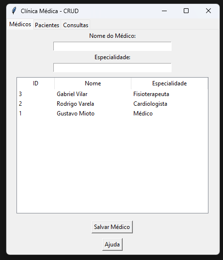
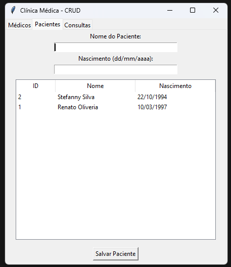
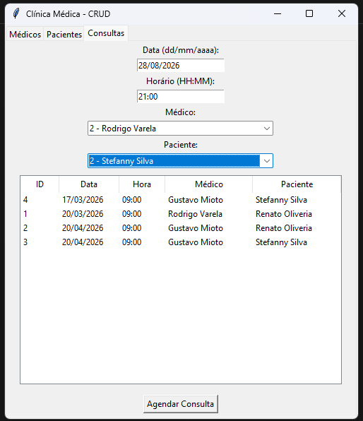

# 🏥 Clínica Simples

Aplicação desenvolvida em Python para gerenciamento e organização de informações de uma clínica médica.

## 🚀 Funcionalidades

* Cadastro e visualização de médicos
* Cadastro e gerenciamento de pacientes
* Agendamento de consultas
* Visualização das informações cadastradas
* Persistência dos dados utilizando SQLite
* Interface gráfica para interação com o sistema

## 🛠 Tecnologias Utilizadas

* Pyhton
* Tkinter — interface gráfica
* SQLite — banco de dados

## 📸 Screenshots

<p align="center">
  
  
  
</p>

## ⚙️ Como Executar

```bash
git clone https://github.com/daniloocavalcante/ClinicaSimples
cd ClinicaSimples

python main.py

```

## 👨‍💻 Autor

Danilo Cavalcante

🔗 GitHub: https://github.com/daniloocavalcante

Projeto desenvolvido para fins de estudo e aprendizado.

